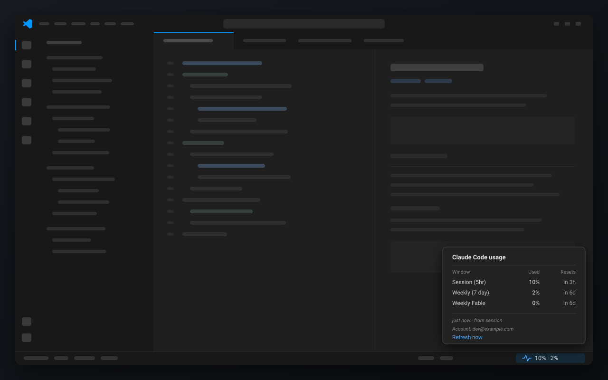

# ClaudeStats

[](https://github.com/awmium/claude-stats/actions/workflows/test.yml)
[](LICENSE)

Your Claude Code usage, sitting in the VS Code status bar where you'll actually see it.



No more opening a panel to find out you're at 90%. The number is just there, it goes amber
at 80% and red at 95%, and hovering shows you every limit your plan has along with when
each one resets.

It costs you nothing. Nothing here calls a model — see [tokens](#does-this-cost-me-tokens).

## Install

You'll need Claude Code signed in on a paid plan, Node 20+, and VS Code 1.85+ (Insiders
and Cursor work too).

```bash
git clone https://github.com/awmium/claude-stats.git
cd claude-stats
./scripts/install.sh          # macOS / Linux
```

```powershell
.\scripts\install.ps1         # Windows
```

Then **quit VS Code completely and reopen it** — a window reload won't pick up a new
extension. You'll see `—` until your next Claude Code message, because that's when the
first reading arrives.

Flags, if you need them: `--target insiders`, `--target cursor`, `--force`. On PowerShell
it's `-Target Insiders` and so on.

### Already using a custom status line?

Claude Code only allows one. The installer spots yours, leaves it alone, and tells you. To
run both, point `statusLine` at a wrapper:

```bash
#!/usr/bin/env bash
input=$(cat)
printf '%s' "$input" | node ~/.claude/claude-stats/statusline-usage.js > /dev/null
printf '%s' "$input" | your-existing-statusline
```

Or re-run with `--force` and hand the hook over.

## How it works

Two small pieces.

A **bridge** sits on Claude Code's `statusLine` hook. Every message, Claude Code pipes it
the live session state, which includes your usage. It caches that to a file and passes the
percentages back so your Claude Code status line still works.

The **extension** watches that file. When no session has reported for a while it falls back
to asking the usage endpoint directly, so the number doesn't freeze the moment you stop
working.

Which rows you see is up to your account, not up to ClaudeStats. The server sends the list
of windows it tracks for you, names included — so if your plan has a per-model budget it
shows up on its own, and if it doesn't, there's simply no row.

**Switch accounts and it notices.** Every cached reading is stamped with the account that
produced it. Sign in as someone else and ClaudeStats shows `—` until real data arrives,
rather than quietly showing you the last account's numbers.

## Settings

| Setting | Default | |
| :-- | :-- | :-- |
| `claudeStats.pollWhenStale` | `true` | Ask the usage endpoint when no session has reported lately. Turn it off to stay fully offline. |
| `claudeStats.staleAfterMinutes` | `10` | How stale a reading can get before that kicks in. |

`CLAUDE_CONFIG_DIR` is respected if you've moved your Claude Code config.

## Does this cost me tokens?

No. Tokens get spent on inference — calls to `/v1/messages`. Nothing here makes one.

The bridge is a Node script reading stdin and writing a file, running inside a session you
were already having. The extension watches a file. The poll hits an endpoint that *reports*
your limits rather than drawing against them — the same one Claude Code itself calls every
hour.

## About your credentials

Worth being upfront, since it reads your Claude Code state:

- **Nothing is stored.** The cache file holds percentages, reset times and which account
  they belong to. No token, no conversation content.
- **The access token** gets read into memory for one request and thrown away. Never
  written, cached, logged, or put in a URL. If it's expired, no request is made at all. On
  a 401 it gives up rather than refreshing, because refreshing would mean writing to your
  credentials file.
- **One network call**, to `api.anthropic.com`. No telemetry, no analytics, no
  dependencies that could add any.
- **Don't want even that?** Set `claudeStats.pollWhenStale` to `false` and it touches no
  credentials at all.

Every path and header is documented in [SECURITY.md](.github/SECURITY.md). The whole thing
is about 250 lines of dependency-free JavaScript — have a read.

## When it misbehaves

**Nothing in the status bar.** Quit VS Code fully rather than reloading. Still nothing?
`Ctrl+Shift+P` → *Developer: Show Running Extensions* and look for ClaudeStats. If it's not
there, check the folder exists with `ls ~/.vscode/extensions/claude-stats.claude-stats-*`
and re-run the installer.

**Stuck on `—`.** Send one message in Claude Code. If it stays empty, make sure the hook
registered:

```bash
node -e "const o=require('os');console.log(require(o.homedir()+'/.claude/settings.json').statusLine)"
```

**`—` right after switching accounts.** That's deliberate. It clears on the next message.

**`HTTP 401` in the hover.** Token expired; using Claude Code refreshes it.

**Nothing at all on an API key, Bedrock or Vertex.** Those have no plan limits, so there's
nothing to show.

## Uninstall

```bash
./scripts/uninstall.sh        # macOS / Linux
.\scripts\uninstall.ps1       # Windows
```

Takes out the extension, the bridge, the cached reading, and the `statusLine` entry — but
only if that entry is ours. Your original `settings.json` was backed up on first install.

## Contributing

Tests are `npm test` — 31 of them, no network, no dependencies, no build step. They run
against a throwaway config directory so they never touch your real Claude Code state.

Have a look at [CONTRIBUTING.md](.github/CONTRIBUTING.md) first; the short version is
write the failing test before the fix, and prove it fails.

## Worth knowing

`/api/oauth/usage` is undocumented and could change. If it does, the bridge carries on and
you just lose the idle refresh.

Organisation credit pools aren't shown. On Team plans that's billing state you often can't
control, so it isn't your usage and it doesn't belong next to your limits.

## License

MIT. Not affiliated with or endorsed by Anthropic.
